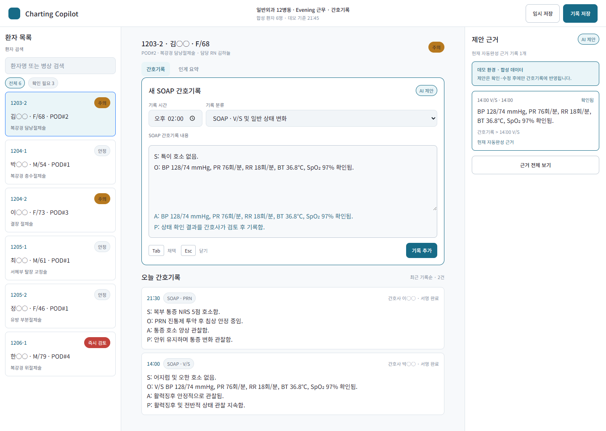
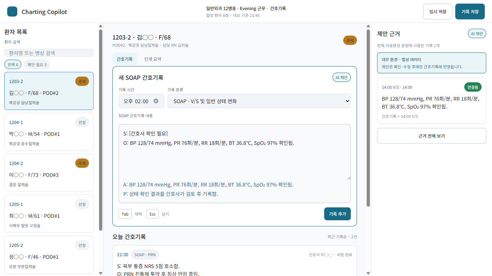
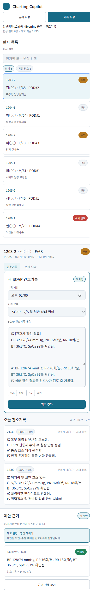

# SOAP Charting Copilot MVP acceptance

## 2026-08-31 input-grounded AI addendum

The approved extension adds one server-side suggestion route while preserving the original deterministic experience. Automated coverage now verifies that the edited nurse text is posted after a 700 ms debounce, the immediate SOAP fallback stays visible during loading and failure, only the latest verified model result replaces it, and an inactive/missing key returns `missing-key` without breaking `Tab` acceptance.

The public build remains synthetic-only. `OPENAI_API_KEY` is not configured in the repository and the model path therefore remains disabled until the deploy owner activates the key, sets it as a Vercel server environment variable, and applies project budget and rate-limit controls. `OPENAI_MODEL` defaults to `gpt-5-mini-2025-08-07` when omitted.

Final extension verification:

```text
npm run verify

12 test files passed
96 tests passed
Component CSS verification passed.
Production build passed.
Build artifact verification passed: dist/index.html references 2 bundled assets.
```

Verified on 2026-08-28 against the production Vite build on Windows with local Chromium. No deployment or other external publication was performed.

## Result

The MVP passes the automated quality gates, build-artifact verification, and local browser acceptance checks for the approved desktop hierarchy, the 1366px compatibility target, the narrow stacked workflow, keyboard-only authoring, explicit suggestion provenance lifecycle, unsigned demo authorship, focus visibility, textual safety/status communication, and reduced motion.

One browser defect was observed and fixed during acceptance: the undeclared site icon caused `/favicon.ico` to return 404. The real-browser check failed before the local SVG icon was declared and passed after rebuilding.

## Commands and evidence

### Build artifact RED → GREEN

The pre-existing generated `dist/` directory was temporarily renamed and restored; no unrelated file was deleted.

```text
node scripts/verify-build.mjs

Build artifact verification failed:
- Missing production entry point: dist/index.html
- Missing bundled assets: dist/assets must contain production files
EXPECTED_RED_EXIT=1
```

A self-review mutation then temporarily renamed only the JavaScript bundle. The first implementation incorrectly passed (exit 0), proving that it did not protect the complete asset contract. After tightening the check, the same mutation failed with `Missing .js production bundle in dist/assets` and exit 1; restoring the bundle returned the check to GREEN. The verifier now requires referenced JavaScript and CSS bundles.

After `npm run build`:

```text
dist/index.html                   0.47 kB
dist/assets/index-BO2G5KB2.css   17.34 kB
dist/assets/index-MILAF-m8.js   211.23 kB
Build artifact verification passed: dist/index.html references 2 bundled assets.
```

`package.json` now runs the build before `verify:build`, so `npm run verify` also works in a clean checkout where `dist/` does not yet exist.

### Production preview and browser workflow

```powershell
npm exec -- vite preview --host 127.0.0.1 --port 4175 --strictPort
node scripts/verify-browser-acceptance.mjs
```

The required in-app Browser workflow was attempted first with its bundled browser client, `getForUrl("http://127.0.0.1:4175/")`, and a complete-documentation request. Its persistent JavaScript runtime exited before browser selection on every attempt with `windows sandbox failed: helper_unknown_error: setup refresh had errors`; even a one-line health check failed. The installed Windows computer-control fallback used the same unavailable runtime.

Acceptance therefore continued through the permitted standalone fallback. `scripts/verify-browser-acceptance.mjs` launches an installed local Chromium browser headlessly, connects through Chromium DevTools, inspects the real production page, injects native key events, checks browser-computed styles, captures screenshots, and fails on browser exceptions/log errors, any DevTools `Network.loadingFailed` event, or any HTTP(S) application request whose host is not loopback. Inline non-network URLs such as the browser-rendered time-input icon remain allowed. `BROWSER_BIN` can override the detected Chrome/Edge executable.

Final browser result:

```text
Browser acceptance verification passed.
browserErrors: []
network.failures: []
network.nonLoopbackApplicationRequests: []
```

### Viewport findings

| Viewport | Finding |
|---|---|
| 1440×1024 | Asserted header exactly 64px; columns exactly 288px / 816px / 336px; composer exactly 720px and centered. Timeline began at y=642 and remained visible; the full evidence rail was visible. |
| 1366×768 | Asserted columns exactly 288px / 742px / 336px, with touching boundaries and no overlap. The workspace had a 727px usable client width after its 15px vertical scrollbar; subtracting 24px responsive padding on each side produced the measured and asserted 679px composer. It was centered at x=651.5, stayed within the flexible column, and no core control or document content clipped horizontally. |
| 390×844 narrow override | The page had no horizontal overflow after accounting for the vertical scrollbar (375px client and scroll widths). Full-page order was patient rail → SOAP workspace → evidence rail. Search, editor, evidence, draft save, record save, record add, and evidence expansion were present and within the content width. |

Visual inspection found clear panel boundaries and hierarchy, readable clinical copy, balanced desktop density, intact header actions, and a coherent narrow flow. At 1366px the vertical scrollbars are visible by design because each desktop rail scrolls independently.

### Keyboard, focus, status, and safety findings

- Starting from the page body, 17 plain `Tab` presses reached the unified narrative editor. The computed focus outline was `2px solid rgb(43, 127, 255)`.
- Plain `Tab` in the focused editor accepted the active suggestion, added A/P text to the editable value, removed the preview and keyboard-action group, retained editor focus, and changed both center and rail status to `AI 문장 채택됨`. The rail read `채택한 AI 문장 근거 기록 1개` and the linked record read `채택한 AI 문장 근거`, never “현재 자동완성”.
- `Escape` dismissed the suggestion without changing the narrative value or moving focus. The preview, keyboard-action group, center/rail AI badges, evidence cards, and linkage labels were absent in the collapsed state; the rail explicitly read `활성 제안 없음`.
- `Shift+Tab` moved from the editor to the category select while leaving the suggestion pending.
- Keyboard navigation reached synthetic patient `1204-1`; `Enter` selected it and updated the patient context. After keyboard acceptance, a second `Tab` reached `기록 추가`, and `Enter` added a new record at the same `20:00` timestamp as the fixture. The new card was first, read `데모 저장 · 서명 전`, contained `S: 수술 부위 당김감 경미하게 호소함.`, contained no bracketed review/TODO marker, and left the older `간호사 최○○ · 서명 완료` fixture second. Feedback read `20:00 SOAP 간호기록 1건을 추가했습니다.` and the timeline reported two records.
- Evidence cards displayed their actual source-record state (`확인됨` or `최근`) independently. Integration coverage also expanded dismissed evidence and proved confirmed V/S, drain, and diet records did not become `확인 필요` merely because they were unlinked.
- Textual statuses included `안정`, `주의`, `즉시 검토`, `AI 제안`, `AI 문장 채택됨`, source record state, and lifecycle-specific linkage copy; state was not communicated by color alone.
- The visible disclosure read `데모 환경 · 합성 데이터` and `제안은 확인·수정 후에만 간호기록에 반영됩니다.`
- Chromium matched `prefers-reduced-motion: reduce`; editor and button transition durations computed to `1e-05s` (the `0.01ms` reduced-motion token).
- Chromium matched `forced-colors: active`; the focused editor remained a textarea with a computed `2px solid rgb(26, 235, 255)` outline, and the configured focus token remained the system color `Highlight`. The harness asserts the media match, system token, focused element, non-`none` outline style, positive width, and non-transparent color. `npm run verify:css` separately confirms the forced-colors focus rules and semantic focus tokens.
- DevTools Network observed 33 application resource events across the acceptance navigations. All HTTP(S) requests used `127.0.0.1`; the only non-HTTP resource was an inline data URL used by Chromium for the time-input icon. Loading failures and non-loopback application requests were both empty and are asserted.

### Screenshots

#### 1440×1024



#### 1366×768



#### Narrow 390×844 full flow

This full-page capture uses a 390×844 viewport override and records the complete stacked document rather than only the first 844px.



## Final project verification

```text
npm run verify

6 test files passed
67 tests passed
Component CSS verification passed.
Production build passed.
Build artifact verification passed: dist/index.html references 2 bundled assets.
```

The standalone follow-up `node scripts/verify-build.mjs` also passed with the same two referenced assets.

## Known MVP limitations and deferred test triage

- All patients and chart facts are synthetic. State exists only in the browser and resets on refresh; there is no backend, authentication, EMR integration, audit signing, real model call, or persistent storage.
- Suggestions are deterministic demonstration scaffolding, not a clinical model. They must remain nurse-reviewed and are not decision support.
- SBAR and physician documentation remain out of scope.
- The narrow layout intentionally becomes a long single document so patient selection, workspace, timeline, and provenance stay available in source and reading order.
- The in-app Browser and Windows computer-control runtimes were unavailable because their shared JavaScript sandbox failed before connection. Screenshots and interaction evidence came from the local Chromium fallback, not the in-app Browser surface.
- The previously deferred minor gaps are covered: the domain suite includes a direct `일반` suggestion row, and the workspace suite searches the real patient rail by bed number.

## Vercel free-deployment steps (not executed)

Vercel documents zero-configuration Vite support and says to deploy an existing Vite project by running the Vercel CLI from the project root: [Vite on Vercel](https://vercel.com/docs/frameworks/frontend/vite). Its Hobby plan is free but limited to personal, non-commercial use, so confirm the intended demo qualifies before proceeding: [Vercel Hobby plan](https://vercel.com/docs/plans/hobby).

1. Confirm the intended use qualifies for Vercel Hobby. Use a paid plan instead for commercial/customer-facing use that falls outside Hobby terms.
2. From this repository, run `npm run verify` and `node scripts/verify-build.mjs`.
3. Install the current CLI: `npm install -g vercel`.
4. Authenticate interactively: `vercel login`.
5. Link or create the project from `C:\dev\charting_assistant`: `vercel link`. Select the intended Hobby scope and allow Vercel to detect Vite. If prompted, use build command `npm run build` and output directory `dist`.
6. Create a preview deployment: `vercel deploy`. Review the returned preview URL and deployment logs before promotion.
7. After explicit publication approval and preview acceptance, create the production deployment: `vercel deploy --prod`.
8. Verify the returned production URL and check error logs. Vercel’s current CLI workflow is documented at [Deploying a project from the CLI](https://vercel.com/docs/projects/deploy-from-cli).

Step 6 already publishes a preview URL and step 7 publishes production. Neither command was run during this task because external publication requires a separate explicit action.
